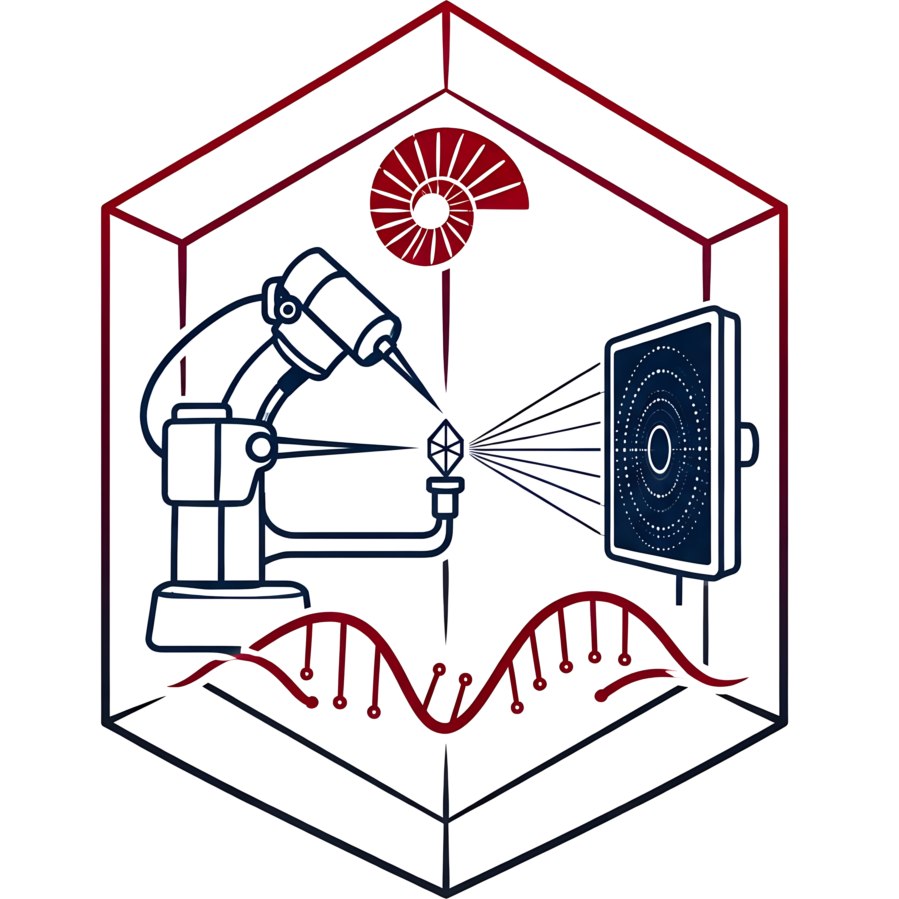

<div align="center">

  

  # KUYBİİGST-M Web Platformu
  ### Koç Üniversitesi Yapısal Biyoloji İleri Araştırma Merkezi
  **Center of Excellence for Structural Biology at Koç University**

  <p align="center">
    Doç. Dr. Hasan Demirci liderliğindeki KUYBİİGST-M araştırma laboratuvarının resmi web platformu; yüksek çözünürlüklü yapısal biyoloji, ribozom dinamikleri, seri femtosaniye kristalografi (SFX), kryo-EM ve ilaç keşfi araştırmalarını global bilim dünyasıyla buluşturur.
  </p>

  <p align="center">
    <a href="https://kuybiigstm-website.vercel.app/" target="_blank">
      
    </a>
  </p>

  <p align="center">
    
    
    
    
    
    
    
    
  </p>

  <p align="center">
    <a href="#-proje-hakkında">Proje Hakkında</a> •
    <a href="#-öne-çıkan-özellikler">Öne Çıkan Özellikler</a> •
    <a href="#-mimari-ve-proje-yapısı">Proje Yapısı</a> •
    <a href="#-canlı-google-e-tablo-senkronizasyonu">Google Sheets CMS</a> •
    <a href="#-yayınlar-veri-tabanı--sayfalama">Yayınlar Veri Tabanı</a> •
    <a href="#-kurulum-ve-yerel-geliştirme">Kurulum</a> •
    <a href="#-erişilebilirlik-ve-performans">Erişilebilirlik</a> •
    <a href="#-ekip-ve-geliştirici">Ekip</a>
  </p>

</div>

---

## 🔬 Proje Hakkında

**KUYBİİGST-M (Koç Üniversitesi Yapısal Biyoloji ve İlaç Keşfi İleri Araştırma Merkezi)**, Stanford University SLAC Ulusal Hızlandırıcı Laboratuvarı, Duke Üniversitesi RNA Enstitüsü, Kumamoto Üniversitesi ve Koç Üniversitesi bünyesindeki multidisipliner laboratuvarlarla entegre biçimde çalışan uluslararası bir araştırma merkezidir.

Bu web platformu, laboratuvarın prestijli uluslararası dergilerde (*Nature, Science, PNAS, JACS, Nucleic Acids Research*) yayımlanan **86+ hakemli bilimsel makalesini**, interaktif figür ve tablo arşivlerini, dinamik araştırmacı kadrosunu ve küresel akademik ortaklıklarını modern web standartlarında sergilemek üzere geliştirilmiştir.

---

## ✨ Öne Çıkan Özellikler

### 1. 📊 Canlı Google E-Tablo CMS Senkronizasyonu (Headless Sheet)
* Ekip üyeleri, unvanlar, biyografiler, araştırma alanları ve fotoğraflar hiçbir kod değişikliğine veya yeniden derlemeye (*re-deploy*) ihtiyaç duymadan **canlı bir Google E-Tablosu** üzerinden güncellenir.
* `/teams` rotası ve `/api/team` uç noktası `export const dynamic = 'force-dynamic'` ve `revalidate = 0` mimarisiyle çalışarak her istekte doğrudan en güncel veriyi sunar.
* E-Tablo'ya ulaşılamaması veya ağ kesintisi durumunda statik önbellek otomatik olarak devreye girer (*graceful fallback*).
* Arama çubuğu üzerinden ekip üyeleri isim, unvan veya uzmanlık alanına göre anlık filtrelenir ve tam alfabetik sıra ile listelenir.

### 2. 📚 Kapsamlı Yayınlar (Publications) Veri Tabanı & Sayfalama
* **86+ Bilimsel Yayın Arşivi:** 2002 yılından günümüze kadar tüm makaleler yapılandırılmış meta verilerle sunulur.
* **Akıllı Sayfalama (Numbered Pagination):** 10, 20 veya 50 kayıt seçeneği; sayfa numaraları (`1, 2, 3...`), "Önceki/Sonraki" butonları ve geçişte yumuşak otomatik kaydırma (*smooth scroll*).
* **Anlık Arama & Yıl Filtresi:** Makale başlığı, yazar adı, dergi ismi, özet (abstract), PMID, DOI ve yıl bazında anında filtreleme.
* **Yüksek Çözünürlüklü Figür & Tablo Lightbox:** Makalelerde yer alan yapısal biyoloji modelleri ve şemaları modal lightbox penceresinde tam çözünürlükle incelenebilir.
* **Tek Tıkla Doğrudan Erişim:** PubMed, PMC ve DOI kaynaklarına doğrudan dış bağlantılar.

### 3. 🌐 Çift Dilli Altyapı (TR / EN i18n)
* React 19 ve Next.js Turbopack ile %100 uyumlu, **hydration mismatch** hatası üretmeyen `useSyncExternalStore` tabanlı yerel çift dil motoru (`lib/i18n.tsx`).
* Navbar üzerindeki tek dokunuşlu `[TR | EN]` anahtarı ile tüm sayfalar (başlıklar, filtreler, etiketler, arama yer tutucuları ve altbilgi) anında çevrilir.
* Dil tercihi `localStorage` üzerinde saklanır ve tarayıcı sekmeleri arasında anlık senkronize edilir.
* Akademik terminolojiye ve Türk Dil Kurumu standartlarına uygun özenli çeviriler (Örn: *[Yapısal Biyoloji Labı]*).

### 4. ⚡ Ultra Hızlı Video Yükleme (YouTube Facade)
* Ağır YouTube `iframe` öğeleri sayfada ilk anda yüklenmez; böylece **First Contentful Paint (FCP)** ve **Largest Contentful Paint (LCP)** değerleri maksimum düzeyde tutulur.
* `YouTubeFacade` bileşeni ile video afişi hafif web görseli olarak gösterilir; kullanıcı tıklayana kadar hiçbir harici JavaScript dosyası yüklenmez.

### 5. 🎨 Organik Paralaks & Bulut Efektli Kahraman (Hero) Alanı
* Koç Üniversitesi Rumelifeneri Kampüsü ve Karadeniz manzarasını derinlik hissiyle sunan donanım hızlandırmalı (`translate3d`, `requestAnimationFrame`) paralaks kaydırma motoru.
* Kullanıcının hareket kısıtlama tercihine (`prefers-reduced-motion`) tam duyarlılık.
* Havada süzülen bulut silüeti (`CloudHeroCard`) ile modern, sıcak ve akılda kalıcı karşılama arayüzü.

### 6. ♿ WCAG 2.1 AA Seviyesi Erişilebilirlik (A11y)
* **Kusursuz Başlık Sıralaması:** Sayfa bütününde düzeyi atlamayan, hiyerarşik `h1 -> h2 -> h3` semantik akışı.
* **Yüksek Renk Kontrastı:** Açık ve koyu zeminlerde WCAG AA (≥ 4.5:1) eşiğini aşan `text-slate-600` / `text-slate-700` ve `text-slate-300` renk paleti.
* **Ekran Okuyucu Dostu:** Tüm butonlar ve arama girdileri için eksiksiz `aria-label` değerleri; yanındaki metinle çakışan dekoratif görseller için `alt="" aria-hidden="true"` optimizasyonu.

---

## 🏗️ Mimari ve Proje Yapısı

```text
kuybim-web/
├── app/
│   ├── layout.tsx                # Kök HTML, Geist fontları, Metadata ve genel yapı
│   ├── page.tsx                  # Ana sayfa (Hero, Araştırma, Yayınlar, PI, İşbirlikleri)
│   ├── globals.css               # Tailwind CSS v4 direktifleri ve özel animasyonlar
│   ├── sitemap.ts                # Arama motorları için dinamik site haritası
│   ├── robots.ts                 # Robot tarayıcı yönergeleri
│   ├── manifest.ts               # PWA Web Uygulama Manifesti
│   ├── api/
│   │   └── team/
│   │       └── route.ts          # Google Sheets CSV'yi JSON'a dönüştüren dinamik API
│   ├── components/
│   │   ├── Navbar.tsx            # Çift dilli, duyarlı gezinme çubuğu ve logo
│   │   ├── Footer.tsx            # İki dilli altbilgi, telif ve hızlı bağlantılar
│   │   ├── HeroParallax.tsx      # Kampüs manzaralı donanım hızlandırmalı paralaks
│   │   ├── CloudHeroCard.tsx     # Süzülen bulut kartı bileşeni
│   │   ├── PublicationsSection.tsx# Sayfalama, filtreleme ve modal destekli yayın arşivi
│   │   └── YouTubeFacade.tsx     # Tıklamayla yüklenen yüksek performanslı video bileşeni
│   └── teams/
│       ├── page.tsx              # Ekip sayfası (Sunucu tarafı dinamik veri çekme)
│       ├── TeamsHeader.tsx       # Sayfa başlığı ve Hasan Demirci öncelikli kartı
│       └── TeamView.tsx          # Canlı arama, A-Z sıralama ve biyografi modalı
├── data/
│   ├── publications.json         # 86 yayının tam bibliyografik ve figür veri tabanı
│   └── initialTeam.json          # Google E-Tablo öncesi hazır çevrimdışı ekip yedeği
├── lib/
│   ├── i18n.tsx                  # useSyncExternalStore tabanlı TR/EN dil sağlayıcısı
│   └── teamParser.ts             # Google Sheets CSV formatını ayrıştıran yardımcı modül
├── public/
│   └── img/                      # Kampüs duvar kağıdı, logolar ve figür görselleri
├── package.json                  # Bağımlılıklar ve derleme betikleri
├── tsconfig.json                 # TypeScript yapılandırması
├── next.config.ts                # Next.js Turbopack ve görsel alan adı ayarları
└── README.md                     # Proje dokümantasyonu
```

---

## ⚙️ Canlı Google E-Tablo Senkronizasyonu

Platform, araştırmacı kadrosunun güncellenmesi için harici bir veritabanı yönetim paneline ihtiyaç duymaz.

```text
[ Yönetici Google Sheets E-Tablosunu Günceller ]
                      │
                      ▼
        [ Google Sheets CSV Export API ]
                      │
                      ▼
     [ Next.js Server Route: /api/team ]
            (revalidate = 0 / no-store)
                      │
                      ▼
        [ parseTeamMembers() Parser ]
  (Slug üretimi, görsel URL doğrulama, satır temizleme)
                      │
                      ▼
     [ /teams Sayfası ve Arama Arayüzü ]
  (Alfabetik A-Z sıralama, anlık arama, biyografi modalı)
```

E-Tablo sütun yapısı:
* `İsim` (Zorunlu)
* `Pozisyon` (Zorunlu)
* `Kategori` (Opsiyonel: Doktora Sonrası, Doktora Öğrencisi, Lisans vb.)
* `Biyografi & Araştırma Alanı` (Zorunlu)
* `Fotoğraf URL` (Google Drive veya web bağlantısı)

---

## 🛠️ Teknoloji Yığını

| Alan | Teknoloji / Kütüphane | Kullanım Amacı |
| :--- | :--- | :--- |
| **Framework** | [Next.js 16.3.4](https://nextjs.org/) (App Router + Turbopack) | Sunucu bileşenleri, dinamik API rotaları ve yüksek hızlı derleme |
| **Kütüphane** | [React 19.2.8](https://react.dev/) | Modern UI bileşenleri ve `useSyncExternalStore` entegrasyonu |
| **Dil** | [TypeScript 5](https://www.typescriptlang.org/) | Uçtan uca tip güvenliği ve otomatik doğrulama |
| **Stil / CSS** | [Tailwind CSS v4](https://tailwindcss.com/) | Modern atomik CSS, duyarlı tasarım ve performanslı animasyonlar |
| **Yazı Tipi** | Geist Font Ailesi (`next/font`) | Optimize edilmiş, sıfır CLS modern tipografi |
| **CMS** | Headless Google Sheets CSV API | Sıfır maliyetli, anlık güncellenen ekip yönetim motoru |
| **Dağıtım** | [Vercel Edge Platform](https://vercel.com/) | Global CDN, otomatik CI/CD ve HTTPS dağıtımı |

---

## 🚀 Kurulum ve Yerel Geliştirme

Projeyi yerel bilgisayarınızda çalıştırmak için aşağıdaki adımları izleyin:

### Gereksinimler
* [Node.js](https://nodejs.org/) (v18.18 veya üzeri önerilir)
* [npm](https://www.npmjs.com/) veya [pnpm](https://pnpm.io/)

### 1. Depoyu Klonlayın
```bash
git clone https://github.com/keremuysal/kuybiigstm-website.git
cd kuybiigstm-website
```

### 2. Bağımlılıkları Yükleyin
```bash
npm install
```

### 3. Geliştirici Sunucusunu Başlatın
```bash
npm run dev
```
Tarayıcınızda [http://localhost:3000](http://localhost:3000) adresini açarak projeyi görüntüleyebilirsiniz.

---

## 📦 Ortam Değişkenleri (Environment Variables)

Proje varsayılan olarak tanımlı KUYBİİGST-M e-tablo bağlantısıyla çalışır. Kendi Google E-Tablonuzu bağlamak isterseniz kök dizinde bir `.env.local` dosyası oluşturun:

```env
# Google E-Tablonuzun "Web'de Yayınla -> CSV" bağlantısı:
NEXT_PUBLIC_GOOGLE_SHEET_URL="https://docs.google.com/spreadsheets/d/e/2PACX-.../pub?output=csv"
```

---

## 🧪 Test, Derleme & Performans

| Komut | Açıklama |
| :--- | :--- |
| `npm run dev` | Turbopack ile yerel geliştirici sunucusunu başlatır. |
| `npm run lint` | ESLint ile kod kalitesini ve A11y kurallarını denetler. |
| `npm run build` | Turbopack ile üretime hazır optimize derleme oluşturur. |
| `npm run start` | Üretim derlemesini yerel ortamda test eder. |

---

## ⚡ Performans ve Erişilebilirlik (A11y)

* **Lighthouse Denetim Başarısı:**
  * 🟢 **Erişilebilirlik (Accessibility): 100 / 100**
  * 🟢 **En İyi Uygulamalar (Best Practices): 100 / 100**
  * 🟢 **SEO: 100 / 100**
  * 🟢 **Cumulative Layout Shift (CLS): 0.000** (Sıfır kayma)
  * 🟢 **First Contentful Paint (FCP): 1.0 sn.**
* **9 Megabaytlık Görsel Optimizasyonu & LCP İyileştirmesi:**
  * Ana arka plan görseli (`wallpaper.webp`) 7.5 MB'lık ham PNG formatından saf modern WebP'ye dönüştürülerek **517 KB'a (%93 tasarruf)** düşürüldü; `fetchPriority="high"` ile LCP anında tetiklenir hale getirildi.
  * 4K çözünürlüklü 2.2 MB'lık logo görseli retina netliğinde 512x512 **91 KB'a (%96 tasarruf)** indirildi.
  * YouTube video afişlerinde mobilde 1280x720 yerine 480x360 `hqdefault` formatına geçilerek kritik aktarım boyutu hafifletildi.
* **Sıfır Zorunlu Yeniden Düzenleme (Zero Forced Reflow):**
  * Paralaks kaydırma motoru doğrudan CSS boyutlandırması ve GPU hızlandırmalı `transform: translate3d(...)` ile çalışır; layout thrashing tamamen engellendi.
* **Ağ Ön Bağlantıları:** Google ve YouTube CDN'leri için `<link rel="preconnect">` ve `dns-prefetch` direktifleri devrede.
* **WCAG 2.1 AA Uyumluluğu:** 4.5:1 kontrast oranları, `h1 -> h2 -> h3` semantik başlık hiyerarşisi, ekran okuyucu dostu `aria-label` etiketleri.
* **Klavye Erişimi:** Tüm modal pencereleri `Escape` tuşu ile kapanır; odak (`focus-visible`) tuzakları engellenmiştir.
* **Hareket Duyarlılığı:** Paralaks efektleri `prefers-reduced-motion: reduce` tercihinde otomatik olarak devre dışı kalır.

---

## 👥 Ekip ve Akademik Ortaklıklar

### Laboratuvar Yürütücüsü (Principal Investigator)
* **Doç. Dr. Hasan Demirci**
  * Koç University, Department of Molecular Biology and Genetics
  * Stanford University School of Medicine & SLAC National Accelerator Laboratory
  * E-posta: [hdemirci@ku.edu.tr](mailto:hdemirci@ku.edu.tr) | Ofis: SCI Z59

### İşbirliği Yapılan Başlıca Kurumlar & Laboratuvarlar
* **Puglisi Lab** — Stanford University School of Medicine
* **Wakatsuki Lab** — Stanford University & SLAC
* **Levitt Lab** — Prof. Michael Levitt (2013 Nobel Kimya Ödülü Sahibi) / Stanford
* **Cheng Lab** — Stanford University School of Medicine
* **Agris Lab** — Duke University School of Medicine & The RNA Institute
* **Otsuka Lab** — Kumamoto University & Science Farm Co.
* **NDAL** — Koç Üniversitesi Suna ve İnan Kıraç Vakfı Nörodejenerasyon Laboratuvarı

---

## 📄 Lisans

Bu proje [MIT Lisansı](LICENSE) kapsamında açık kaynak olarak yayımlanmıştır.

---

<div align="center">

  Geliştirici: **[Kerem Uysal](https://github.com/keremuysal)** • [info.keremuysal@gmail.com](mailto:info.keremuysal@gmail.com)

  *Koç Üniversitesi Yapısal Biyoloji İleri Araştırma Merkezi (KUYBİİGST-M)*

</div>
